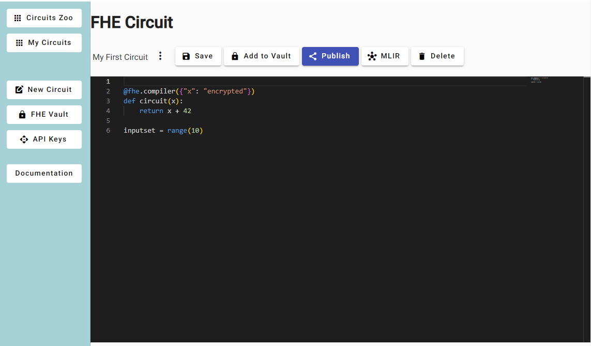
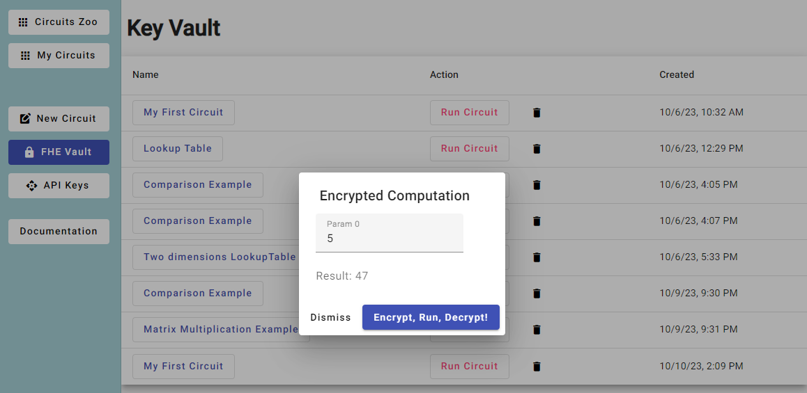

# FHE-Studio UI

[FHE-Studio UI](https://github.com/artifirm/fhe-studio-ui) and [FHE-Studio API](https://github.com/artifirm/fhe-studio-api) is an IDE to develop encrypted programs called circuits in the Python language

## Fully Homomorphic Encryption
Fully Homomorphic Encryption (FHE) is a groundbreaking cryptographic technique that allows computations to be performed on encrypted data without the need to decrypt it first. This means that data can remain confidential while still being processed, opening up new possibilities for secure data outsourcing and privacy-preserving computations. 

## Cloud 
IDE is freely available at https://fhe-studio.com, You need a Gmail account to log in

## Docker
[The fhe-studio image is here.](https://hub.docker.com/r/alextmn/fhe-studio)
Then go to http://localhost:5000 and log in as default user

## Circuit Programming
Please see [FHE Concrete](https://docs.zama.ai/concrete/getting-started/quick_start) engine for quick start and functions supported. 

## Secure Computation on Encrypted Data
With FHE, it becomes possible to perform operations like addition and multiplication on encrypted data. This enables secure data processing in scenarios where privacy is crucial.   

In summary, Fully Homomorphic Encryption is a revolutionary cryptographic technique with the potential to transform the way we handle sensitive data while preserving privacy. While there are challenges related to computational complexity and performance, ongoing research and development aim to make FHE more practical for a wide range of applications.

## Screens
## 1. List of Available Circuits

## 2. Program a Circuit

## 3. Key Vault: Encrypt, Run, Decrypt!

## Development server

Run `ng serve` for a dev server. Navigate to `http://localhost:4200/`. The application will automatically reload if you change any of the source files.

## Build

Run `ng build --configuration=production` to build the project. The build artifacts will be stored in the `dist/` directory.
